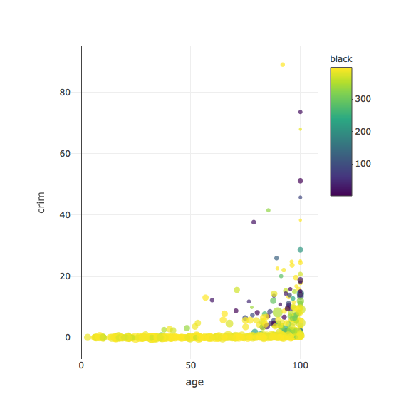

```r
install.packages("MASS")
```

```
## Installing package into '/Users/rileyboeth/Library/R/3.4/library'
## (as 'lib' is unspecified)
```

```
## Error in contrib.url(repos, "source"): trying to use CRAN without setting a mirror
```

```r
install.packages("plotly")
```

```
## Installing package into '/Users/rileyboeth/Library/R/3.4/library'
## (as 'lib' is unspecified)
```

```
## Error in contrib.url(repos, "source"): trying to use CRAN without setting a mirror
```

```r
library(plotly)
```

```
## Loading required package: ggplot2
```

```
## 
## Attaching package: 'plotly'
```

```
## The following object is masked from 'package:ggplot2':
## 
##     last_plot
```

```
## The following object is masked from 'package:stats':
## 
##     filter
```

```
## The following object is masked from 'package:graphics':
## 
##     layout
```

```r
library(MASS)
```

```
## 
## Attaching package: 'MASS'
```

```
## The following object is masked from 'package:plotly':
## 
##     select
```

```r
plot<-plot_ly(Boston, x = ~age, y = ~crim, type = "scatter", size = ~medv, color = ~black)

plot
```

```
## No scatter mode specifed:
##   Setting the mode to markers
##   Read more about this attribute -> https://plot.ly/r/reference/#scatter-mode
```



